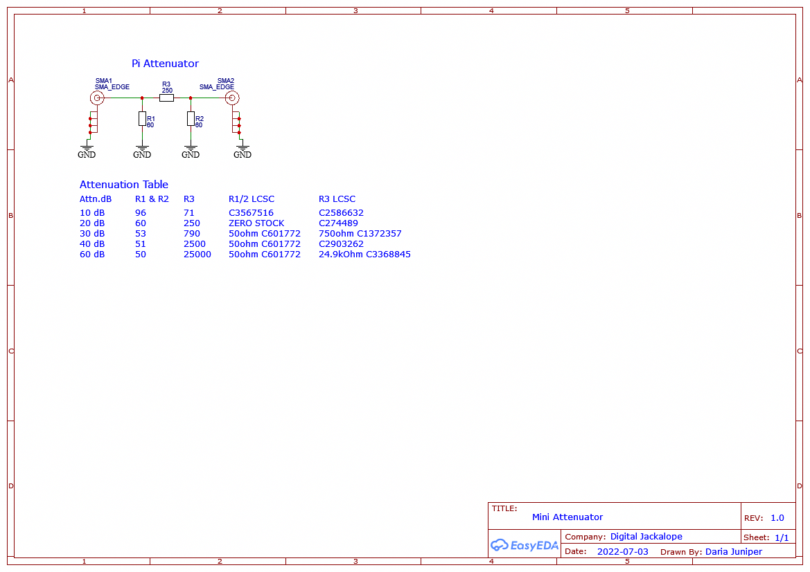

# Mini Attenuator

## Introduction
This repository contains the schematic and Gerber files for a simple inline Pi Attenuator. It was designed for use in amateur radio fox hunts, nothing fancy, cheap to build.

## Schematic

## Files Included
- **Schematic**: A detailed schematic of the Mini Attenuator in png and pdf format.
- **Gerber Files**: Ready-to-use Gerber files for PCB fabrication.

## License
[MIT License](LICENSE)
